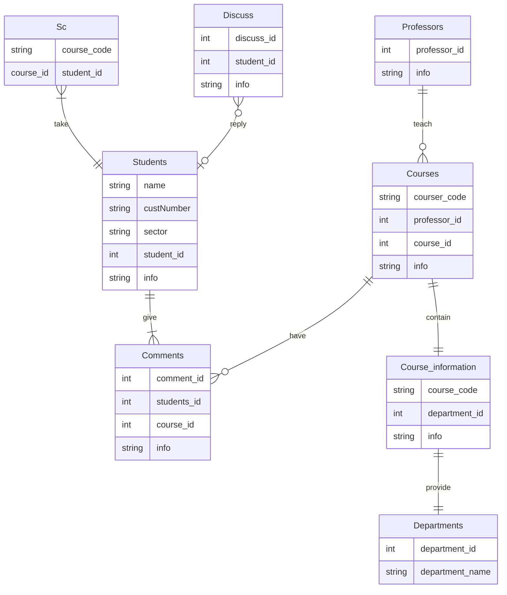

# Beloitwitter
Welcome Software engineers :computer: and UX Designers :iphone:.

This repo presents you the "[Beloitiwtter](https://github.com/EthanWTL/Beloiwitter)" for Beloit College.

You can also preview the website without connection to MS SQL Server [here](https://ethanwtl.github.io/Beloiwitter/).

Here is a demonstration of fully functioning website. 

https://github.com/EthanWTL/Beloiwitter/assets/97998419/4d0f0548-0770-445e-9ac9-0e2acee3de68

## Front-end
```HTML``` ```CSS``` ```JQuery``` ```C#``` ```JavaScript```

1. HTML and CSS deploy the basic structure of web page

```html
<div class="header-search">
    <asp:TextBox ID="search" placeholder="CODE: MATH 110" CssClass="search" runat="server"></asp:TextBox>
    <asp:TextBox ID="professor" placeholder="FIRST NAME" CssClass="professor" runat="server"></asp:TextBox>
    <asp:TextBox ID="time" placeholder="SPRING 2021" CssClass="time" runat="server"></asp:TextBox>
    <asp:TextBox ID="depart" placeholder="DEPARTMENT: MATH" CssClass="depart" runat="server"></asp:TextBox>               
                
    <asp:Button ID="searchBtn" runat="server" Text="Search" OnClick="searchBtn_Click" />
</div>
```

```css
.content-right #searchBtn{
    width: 342px;
    height: 38px;
    background: #373531;
    border: none;
    outline: none;
    border-radius: 5px;
    color: #fff;
    cursor:pointer;
    margin-top:10px;
}
```

2. C# takes charge of default functions like loading and freshing

```c#
protected void Page_Load(object sender, EventArgs e)
        {
            //get comment list for index page
            getCommentList();

            //get user information
            Student userInfo = Session["userInfo"] as Student;
            //check if already exist
            if (userInfo == null)
            {
                return;
            }
            this.nick.Text = this.nickName.Text = userInfo.nick_name;
            this.userImg.ImageUrl = userInfo.user_avatar;
        }
```

3. JQuery and JavaScript take charge of business and functions

```javascript
<!--back to top box-->
<a href="javascript:void(0)" id="return-box">

</a>

</form>
<!--jquery link-->
<script src="./js/jquery-3.5.1.min.js"></script>
<script src="./js/global.js"></script>
```

## Back-end
The Entire project adopted the .Net framework and MVC Structure. 
1. ```Business Logic Layer``` A thin function wrapper for access query in DAL

``` c#
public static List<Comment> getCommentList(int userId)
        {
            return CommentService.getCommentList(userId);
        }
```

2. ```Data Access Layer```
Implement C# with SQL query to interact with databases stored in MS SQL Server.

``` sql
public static List<ShowComment> getIndexCommentList(int pageNum, int pageSize)
        {
            //split page: page number, comment number each page
            int offsetNum = (pageNum - 1) * pageSize;
            string sql = string.Format("select c.comment_id,c.title, c.time, c.img, s.user_avatar,
                         s.nick_name, course.time_offered, p.first_name, p.last_name, course.course_code from comment c left join student s
                         on c.student_id = s.student_id left join course on course.course_id = c.course_id left join professor p
                         on p.professor_id = course.professor_id order by time desc offset {0} rows fetch next {1} rows only", offsetNum, pageSize);

            //execute sql
            SqlDataReader dr = DBHelper.getData(sql);
            //save into data model
            ShowComment commentInfo = null;
            List<ShowComment> commentList = new List<ShowComment>();

            while (dr.Read())
            {
                commentInfo = new ShowComment();
                commentInfo.comment_id = dr.GetInt32(0);
                commentInfo.title = dr.GetString(1);
                commentInfo.time = dr.GetDateTime(2);
                commentInfo.img = dr.GetString(3);
                commentInfo.user_avatar = dr.GetString(4);
                commentInfo.nick_name = dr.GetString(5);
                commentInfo.time_offered = dr.GetString(6);
                commentInfo.professor_name = dr.GetString(7) + " " + dr.GetString(8);
                commentInfo.course_code = dr.GetString(9);
                commentList.Add(commentInfo);

            }
            dr.Close();
            //return info
            return commentList;
        }
```

3. ```Data Model``` Object Class for catching data retrieved from SQL server

```c#
public class Comment
    {
        public int comment_id { get; set; }

        public int student_id { get; set; }

        public int course_id { get; set; }

        public string comment_text { get; set; }

        public string title { get; set; }

        public string img { get; set; }

        public int course_rate { get; set; }

        public DateTime time { get; set; }
    }
```

## Database Management
Data are stored in MS SQL Server and here are the ER-diagrams.


